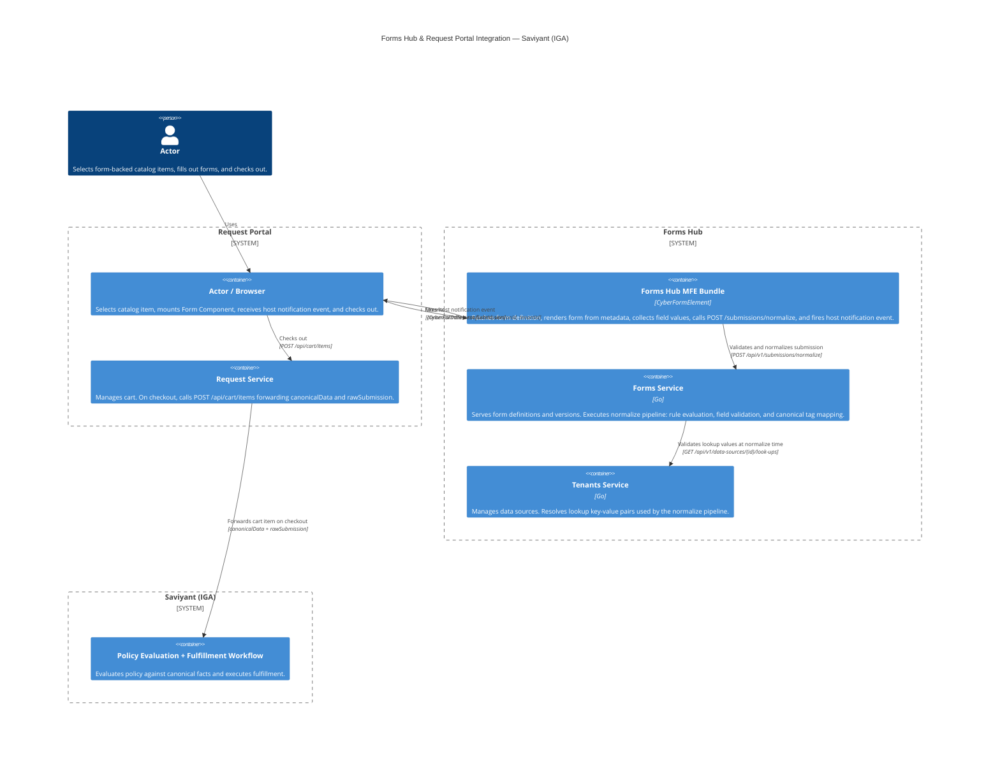

# RFC-001 Forms Hub & Request Portal Integration Diagram

```mermaid
C4Container
  title Forms Hub & Request Portal Integration — Saviyant (IGA)

  Person(actor, "Actor", "Selects form-backed catalog items, fills out forms, and checks out.")

  System_Boundary(requestPortal, "Request Portal") {
    Container(actorBrowser, "Actor / Browser", "", "Selects catalog item, mounts Form Component, receives host notification event, and checks out.")
    Container(requestService, "Request Service", "", "Manages cart. On checkout, calls POST /api/cart/items forwarding canonicalData and rawSubmission.")
  }

  System_Boundary(formsHub, "Forms Hub") {
    Container(mfe, "Forms Hub MFE Bundle", "CyberFormElement", "Fetches form definition, renders form from metadata, collects field values, calls POST /submissions/normalize, and fires host notification event.")
    Container(formsService, "Forms Service", "Go", "Serves form definitions and versions. Executes normalize pipeline: rule evaluation, field validation, and canonical tag mapping.")
    Container(tenantsService, "Tenants Service", "Go", "Manages data sources. Resolves lookup key-value pairs used by the normalize pipeline.")
  }

  System_Boundary(saviyant, "Saviyant (IGA)") {
    Container(igaEngine, "Policy Evaluation + Fulfillment Workflow", "", "Evaluates policy against canonical facts and executes fulfillment.")
  }

  Rel(actor, actorBrowser, "Uses")
  Rel(actorBrowser, mfe, "Mounts", "CyberFormElement formId, versionId, tenantId")
  Rel(actorBrowser, requestService, "Checks out", "POST /api/cart/items")
  Rel(mfe, formsService, "Fetches form definition", "GET /api/v1/form/{id}/version/{id}")
  Rel(mfe, formsService, "Validates and normalizes submission", "POST /api/v1/submissions/normalize")
  Rel(mfe, actorBrowser, "Fires host notification event", "canonicalData + rawSubmission")
  Rel(formsService, tenantsService, "Validates lookup values at normalize time", "GET /api/v1/data-sources/{id}/look-ups")
  Rel(requestService, igaEngine, "Forwards cart item on checkout", "canonicalData + rawSubmission")
```
