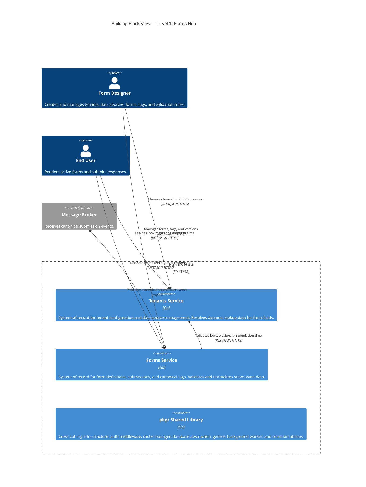
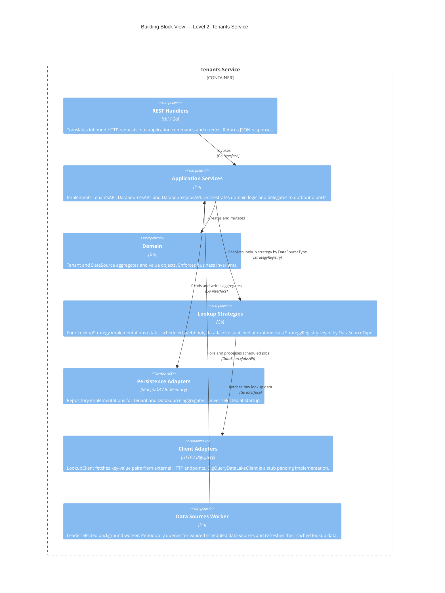
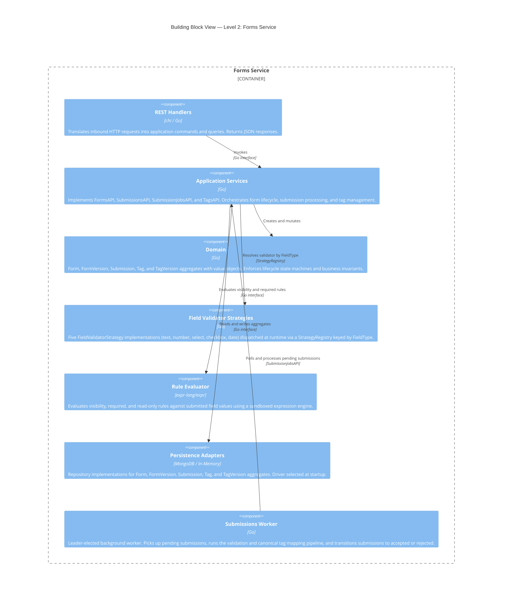
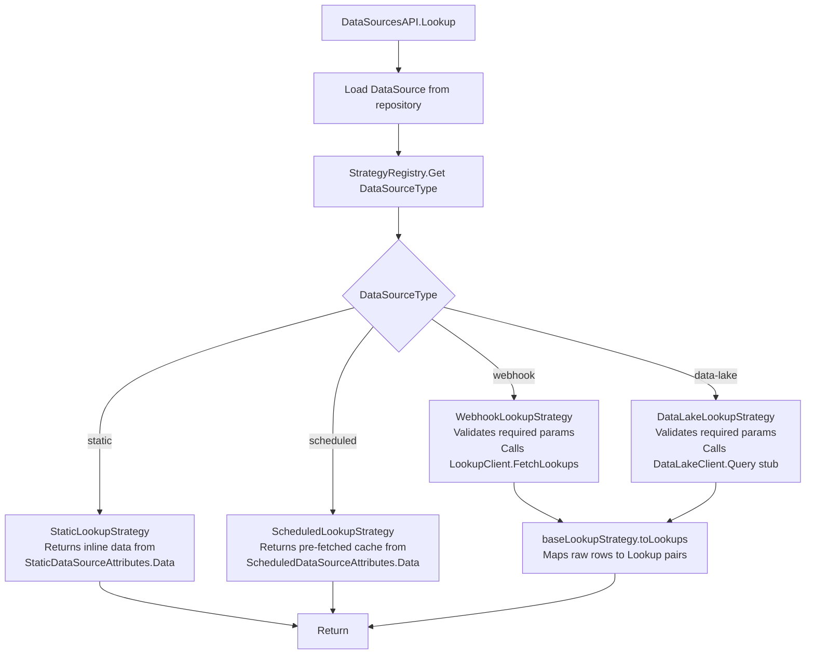
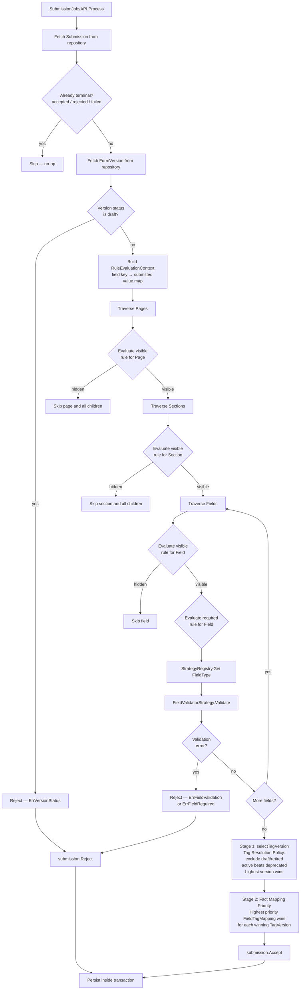
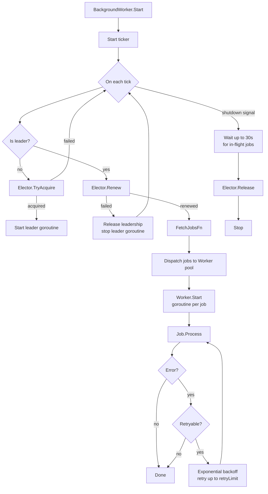
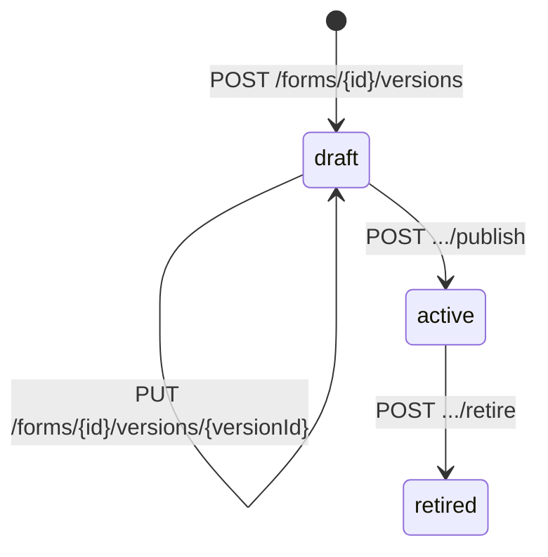
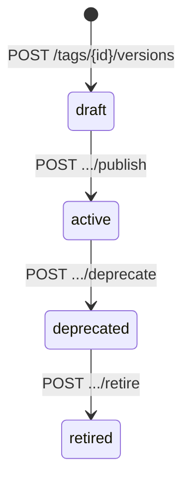

<div align="center">

# Forms Hub Architecture

##### A high-level overview of the architecture of Forms Hub, a platform for building and rendering forms.

</div>

## 1. Introduction and Goals

This document describes Forms Hub, a multi-tenant Software as a Service (SaaS) system designed to standardize how forms are built, rendered, validated, and consumed across enterprise workflows. The system uses a metadata-driven approach to form definition, enabling forms to be created and modified independently of application code.

### 1.1 Requirements Overview

#### 1.1.1 Business Problem

Enterprise organizations often rely on forms to initiate and drive operational workflows, such as access requests, service requests, and approvals. Over time, multiple form-building solutions have evolved independently to support these needs, leading to a fragmented landscape and one-off implementations to meet specific requirements.

At Wells Fargo, current solutions include:

- **Access Request Tool (ART)**: A legacy suite of applications for managing the request, approval, and fulfillment of requests via automated and manual processes. ART includes a form builder that allows users to create forms for various requests. However, the form builder is tightly coupled to requests, which leads to several issues:
  1. **Embedded Business Logic**: The form builder embeds business logic (service request items or SRIs) directly into the form definition, making it difficult to reuse logic across different forms and leading to duplication of logic.
  2. **Tight Coupling**: Changes to the form definitions impact the downstream processing logic, making it difficult to evolve forms independently of the underlying workflow or integration contracts.

- **WorkX**: A newer platform designed and developed to support Consumer Lending workflows. WorkX includes a form builder that allows users to create forms that are associated with specific tasks in a workflow. In WorkX, a form definition is embedded in the task definition, which reduces the reusability of forms and leading to duplication of form definitions across different tasks.

#### 1.1.2 Product Goals

| Goal                          | Description                                                                                                                                                              |
| ----------------------------- | ------------------------------------------------------------------------------------------------------------------------------------------------------------------------ |
| Centralized Form Management   | Provide a centralized system for form design and management, enabling users to create, modify, and manage forms in a single location.                                    |
| Dynamic Form Rendering        | Provide a low-code form rendering without requiring custom frontend or backend development per form.                                                                     |
| Configurable Validation       | Support configurable validation rules to ensure data quality and consistency; allow users to define validation rules that can be applied to form fields and submissions. |
| Canonical Data Transformation | Normalize submission data into canonical structures independent of form layout or field naming, enabling downstream systems to consume data in a consistent format.      |
| Decoupled Form Design         | Decouple form design from downstream integration contracts, allowing forms to evolve independently of the underlying workflow or integration requirements.               |

#### 1.1.3 Key Use Cases

| Use Case               | Actor(s)               | Description                                                                                                                                                                                          |
| ---------------------- | ---------------------- | ---------------------------------------------------------------------------------------------------------------------------------------------------------------------------------------------------- |
| Design a Form          | Form Designer          | A form designer creates a new form version with pages, sections, and fields. She configures validation rules for form elements, and publishes the form before rendering.                             |
| Render a Form          | End User               | An end user loads an active form version; the system evaluates visibility, required, and read-only rules dynamically and renders the form accordingly.                                               |
| Submit a Form          | End User               | An end user submits a form; the system validates the submission, persists it idempotently, and returns a reference identifier for tracking.                                                          |
| Consume Canonical Data | Downstream System      | A downstream system consumes canonical submission data via a message broker or REST API; the system transforms the submission data into a canonical format and delivers it to the downstream system. |
| Manage Lookup Data     | Form Designer / System | A form designer configures a data source to provide dynamic lookup data for form fields across one or more forms.                                                                                    |

#### 1.1.4 Functional Requirements

| Requirement                   | Description                                                                                                                                                                         |
| ----------------------------- | ----------------------------------------------------------------------------------------------------------------------------------------------------------------------------------- |
| Tenant Management             | The system shall support multiple isolated tenants. Each tenant's forms, submissions, tags, and data sources shall be scoped and inaccessible to other tenants.                     |
| Form Definition               | The system shall allow users to define forms as versioned, metadata-driven schemas composed of pages, sections, and typed fields without requiring application code changes.        |
| Form Versioning               | The system shall support a managed lifecycle for form versions: `draft → active → retired`.                                                                                         |
| Dynamic Form Rendering        | The system shall render forms dynamically from their metadata definition without requiring custom frontend or backend development per form.                                         |
| Configurable Validation       | The system shall support configurable visibility, required, and read-only rules on pages, sections, and fields, evaluated at runtime against submitted values.                      |
| Submission Intake             | The system shall accept form submissions asynchronously and idempotently, associating each with a tenant, form version, and a unique reference ID for external tracking.            |
| Canonical Data Transformation | The system shall map submitted field values to canonical tag versions, normalizing data into consistent structures independent of form layout or field naming.                      |
| Data Source Management        | The system shall support configurable lookup data sources (static, scheduled HTTP, webhook, and data lake) to populate dynamic select fields across forms.                          |
| Tag Management                | The system shall support definition and versioning of canonical semantic tags (`draft → active → deprecated → retired`) that field values are mapped to for downstream consumption. |

### 1.2 Quality Goals

### 1.3 Stakeholders

## 2. Contraints

## 3. Context & Scope

### 3.1 System Context

Forms Hub is a multi-tenant SaaS platform that sits at the center of form design, rendering, submission intake, and canonical data delivery. The diagram below shows the system boundary and all external actors and systems that interact with it.


### 3.2 External Interfaces

| External System          | Direction | Protocol                     | Initiator       | Purpose                                                                                                                                                                                                                   | Status              |
| ------------------------ | --------- | ---------------------------- | --------------- | ------------------------------------------------------------------------------------------------------------------------------------------------------------------------------------------------------------------------- | ------------------- |
| **Frontend Application** | Inbound   | REST/JSON over HTTPS         | Frontend        | Form Designers and End Users interact with both services through a generic web UI.                                                                                                                                        | Active              |
| **MongoDB**              | Outbound  | MongoDB wire protocol        | Both services   | Primary datastore. Tenants Service stores tenant and data source records; Forms Service stores forms, form versions, submissions, and tags.                                                                               | Active              |
| **Redis**                | Outbound  | Redis protocol               | Both services   | Both services use Redis-backed distributed locking (`SetNX` + Lua scripts) for background worker leader election.                                                                                                         | Active              |
| **PingFederate**         | Outbound  | JWKS over HTTPS              | Both services   | Both services validate inbound JWT bearer tokens by fetching signing keys from PingFederate's JWKS URI. Audience, issuer, expiry, and issued-at claims are verified.                                                      | Active              |
| **External HTTP APIs**   | Outbound  | HTTP/HTTPS                   | Tenants Service | The Tenants Service calls arbitrary third-party HTTP endpoints to fetch lookup key-value pairs for `scheduled` and `webhook` data sources. Supports `GET`, `POST`, `PUT`, and `PATCH` with configurable headers and body. | Active              |
| **Google BigQuery**      | Outbound  | BigQuery API                 | Tenants Service | The Tenants Service queries a configured data lake to resolve lookup data for `data-lake` data sources, using configurable catalog, schema, query, and field mappings.                                                    | Planned (stub only) |
| **Message Broker**       | Outbound  | Async messaging (e.g. Kafka) | Forms Service   | After a submission is accepted and canonical tag mapping is applied, the Forms Service publishes a canonical submission event for downstream consumption.                                                                 | Planned             |

## 4. Solution Strategy

### 4.1 Architecture Style

Forms Hub is built as a microservice-based system with two independently deployable services - the **Tenants Service** and the **Forms Service** - each owning its own distinct domain model and data storage. The services share a deliberate, minimal integration surface: the Forms Service depends on the Tenants Service to resolve data sources configured by tenants to provide dynamic lookup data for form fields.

Within each service, a **Ports and Adapters (Hexagonal)** architecture style is applied. The domain and application logic is fully isolated from infrastructure concerns. Ports interfaces in `core/ports/` define the contracts; adapter implementations in `adapters/` fulfill them. This boundary means HTTP, MongoDB, Redis, and inter-service communication concerns can be swapped out or tested independently of domain logic. In-memory adapters for every infrastructure concern support local development and testing without external dependencies. Both services also share a common `pkg/` library providing the generic background worker, auth middleware, validation utilities, and the strategy registry — keeping shared infrastructure consistent without coupling service domain models.


_Figure 4.1 — Ports & Adapters (Hexagonal) Architecture pattern. Each Forms Hub service follows this structure: driving adapters (REST handlers) on the left, domain and application services at the centre, and driven adapters (MongoDB, Redis, Tenants Service client) on the right._

### 4.2 Technology Decisions

| Technology       | Decision                | Rationale                                                                                                                                                                                |
| ---------------- | ----------------------- | ---------------------------------------------------------------------------------------------------------------------------------------------------------------------------------------- |
| Go               | Implementation language | Statically typed, high concurrency, fast startup, and a small runtime footprint suited for independently deployable services.                                                            |
| MongoDB          | Database                | The deeply nested, polymorphic form definition hierarchy — pages, sections, fields, and per-type attributes — maps naturally to documents without requiring a complex relational schema. |
| Redis            | Distributed lock        | Provides distributed leader election for background workers in both services without an additional coordination service.                                                                 |
| chi              | HTTP router             | Lightweight and idiomatic Go; composable middleware chain supports cross-cutting concerns (auth, tenant extraction, idempotency, correlation ID) without framework lock-in.              |
| `expr-lang/expr` | Rule evaluation         | Provides safe, sandboxed evaluation of runtime rule expressions (visibility, required, read-only) without the risks of `eval`-style execution.                                           |
| UUID v7          | Entity identifiers      | Time-ordered UUIDs provide natural chronological sort order in MongoDB without a separate sequence or auto-increment mechanism.                                                          |
| PingFederate     | Identity provider       | Enterprise OAuth2/JWKS integration; JWT validation is implemented and ready to activate when authentication is enforced.                                                                 |

### 4.3 Key Design Decisions

- **Asynchronous submission processing** — `POST /submissions` returns 202 immediately; validation and canonical mapping run in a background worker. This decouples intake throughput from validation latency and enables retries without client involvement. Failed jobs are retried with exponential backoff up to a configurable limit; each attempt is recorded as an audit trail on the submission.
- **Strategy pattern for data sources** — Four lookup strategies (static, scheduled, webhook, data lake) share a common interface and are resolved at runtime via a registry. New source types can be added without modifying existing resolution logic.
- **Strategy pattern for field validation** — Each field type (text, number, select, checkbox, date) has its own validator resolved at runtime. Validation logic is isolated per type and independently testable.
- **Generic background worker** — `BackgroundWorker[J Job]` is fully generic and reused by both services for completely different job types (data source refresh and submission processing). Redis-backed leader election ensures only one replica processes jobs at a time across horizontal scale.
- **In-memory adapters for all infrastructure** — Every repository, cache, and elector has an in-memory implementation. No external dependencies are required for local development or unit testing.
- **Explicit inter-service boundary** — The Forms Service holds a `DataSourceRef` on certain fields and calls the Tenants Service at submission time to validate that the submitted value is a member of the current valid lookup set. The Frontend also calls the Tenants Service independently at render time to populate the field options. Outside of this integration point the services share no runtime state, simplifying failure isolation and independent deployment.

## 5. Building Block View

### 5.1 Whitebox System View

Forms Hub is decomposed into two independently deployable services — **Tenants Service** and **Forms Service** — each owning a distinct domain and datastore, plus a shared **`pkg/` library** providing common infrastructure. This functional decomposition reflects that tenant/data-source configuration and form/submission processing are separate, independently evolvable concerns with no shared domain state.



| Building Block            | Responsibility                                                                                                                                                                                                                                   | Source                      |
| ------------------------- | ------------------------------------------------------------------------------------------------------------------------------------------------------------------------------------------------------------------------------------------------ | --------------------------- |
| **Tenants Service**       | System of record for tenant configuration and data source management. Provides CRUD for tenants and data sources, and resolves dynamic lookup key-value pairs via four configurable strategies (`static`, `scheduled`, `webhook`, `data-lake`).  | `backend/services/tenants/` |
| **Forms Service**         | System of record for form definitions, versioned schemas, submissions, and canonical tags. Manages the full form design and submission processing pipeline, including async validation and canonical data normalization.                         | `backend/services/forms/`   |
| **`pkg/` Shared Library** | Cross-cutting infrastructure shared by both services: JWT auth middleware, cache abstraction, MongoDB database abstraction, generic background worker with leader election, HTTP utilities, and the strategy registry. Contains no domain logic. | `backend/pkg/`              |

#### 5.1.1 Blackbox: Tenants Service

The Tenants Service owns all tenant and data source configuration. It exposes a REST API for managing tenants and data sources, resolves lookup key-value pairs on demand via a runtime strategy registry, and runs a background worker that periodically refreshes expired `scheduled` data source caches from their configured HTTP endpoints.

| Interface                                  | Direction | Description                                                    |
| ------------------------------------------ | --------- | -------------------------------------------------------------- |
| `GET/POST/PUT/DELETE /api/v1/tenants`      | Inbound   | CRUD for tenant records                                        |
| `GET/POST/PUT/DELETE /api/v1/data-sources` | Inbound   | CRUD for data sources scoped to a tenant                       |
| `GET /api/v1/data-sources/{id}/look-ups`   | Inbound   | Resolves lookup key-value pairs for a given data source        |
| MongoDB                                    | Outbound  | Persists tenant and data source records                        |
| Redis                                      | Outbound  | Leader election for the data source refresh worker             |
| External HTTP APIs                         | Outbound  | Fetches lookup data for `scheduled` and `webhook` data sources |
| Google BigQuery                            | Outbound  | Queries lookup data for `data-lake` data sources (planned)     |

#### 5.1.2 Blackbox: Forms Service

The Forms Service owns all form definitions, versioned schemas, submissions, and canonical tags. It exposes a REST API for form design and submission intake, runs an async background worker that validates and normalizes pending submissions, and publishes canonical submission events to the message broker upon acceptance.

| Interface                                                   | Direction | Description                                                                        |
| ----------------------------------------------------------- | --------- | ---------------------------------------------------------------------------------- |
| `GET/POST/PUT/DELETE /api/v1/forms`                         | Inbound   | CRUD for forms and their versioned schemas                                         |
| `GET/POST /api/v1/submissions`                              | Inbound   | Submission intake (`202 Accepted`) and listing                                     |
| `POST /api/v1/submissions/{submissionId}/replay`            | Inbound   | Resets a terminal submission to `pending` for reprocessing; returns `202 Accepted` |
| `GET /api/v1/submissions/by-reference/{referenceId}`        | Inbound   | Retrieves a submission by its external reference ID                                |
| `GET /api/v1/submissions/by-reference/{referenceId}/status` | Inbound   | Returns the current status of a submission by reference ID                         |
| `GET/POST/PUT/DELETE /api/v1/tags`                          | Inbound   | CRUD for canonical tags and their versions                                         |
| Tenants Service                                             | Outbound  | Validates submitted lookup values against the live data source at processing time  |
| MongoDB                                                     | Outbound  | Persists forms, versions, submissions, and tags                                    |
| Redis                                                       | Outbound  | Leader election for the submission processing worker                               |
| Message Broker                                              | Outbound  | Publishes canonical submission events upon acceptance (planned)                    |

### 5.2 Level 2

#### 5.2.1 Whitebox: Tenants Service

The Tenants Service follows a Ports and Adapters (Hexagonal) structure. REST handlers on the left drive the application through inbound port interfaces; persistence, client, and worker adapters on the right are driven through outbound port interfaces. The domain and application services at the centre have no dependencies on infrastructure.



| Building Block           | Responsibility                                                                                                                                                                                                                                       | Source                  |
| ------------------------ | ---------------------------------------------------------------------------------------------------------------------------------------------------------------------------------------------------------------------------------------------------- | ----------------------- |
| **REST Handlers**        | Translates HTTP requests and responses to and from application commands and queries. Applies request validation and maps errors to HTTP status codes.                                                                                                | `adapters/rest/`        |
| **Application Services** | Implements `TenantsAPI`, `DataSourcesAPI`, and `DataSourceJobsAPI`. Orchestrates domain construction, persistence, and strategy dispatch. Enforces tenant ownership on all operations.                                                               | `core/services/`        |
| **Domain**               | `Tenant` and `DataSource` aggregates with their value objects (`Lookup`, `DataSourceAttributes`). Enforces invariants and owns all state transitions.                                                                                                | `core/domain/`          |
| **Lookup Strategies**    | Four `LookupStrategy` implementations resolved at runtime by `DataSourceType`: `static` returns inline data; `scheduled` returns the pre-fetched cache; `webhook` makes a live HTTP call; `data-lake` queries BigQuery (stub).                       | `core/strategies/`      |
| **Persistence Adapters** | MongoDB-backed and in-memory repository implementations for `Tenant` and `DataSource` aggregates. Driver is selected at startup via configuration.                                                                                                   | `adapters/persistence/` |
| **Client Adapters**      | `LookupClient` fetches raw key-value rows from external HTTP endpoints for `scheduled` and `webhook` sources. `BigQueryDataLakeClient` is a stub pending implementation.                                                                             | `adapters/clients/`     |
| **Data Sources Worker**  | Leader-elected background worker. On each tick, queries for `scheduled` data sources with an expired cache and delegates refresh to `DataSourceJobsAPI.Process`. Uses Redis-backed leader election to ensure a single active worker across replicas. | `adapters/workers/`     |

#### 5.2.2 Whitebox: Forms Service

The Forms Service follows the same Ports and Adapters structure as the Tenants Service, with two additional driven components: a Rule Evaluator that assesses visibility and required rules at submission time, and a richer set of Field Validator Strategies — one per field type.



| Building Block                 | Responsibility                                                                                                                                                                                                                                                                                                                                     | Source                  |
| ------------------------------ | -------------------------------------------------------------------------------------------------------------------------------------------------------------------------------------------------------------------------------------------------------------------------------------------------------------------------------------------------- | ----------------------- |
| **REST Handlers**              | Translates HTTP requests and responses to and from application commands and queries. Applies idempotency enforcement on submission intake.                                                                                                                                                                                                         | `adapters/rest/`        |
| **Application Services**       | Implements `FormsAPI`, `SubmissionsAPI`, `SubmissionJobsAPI`, and `TagsAPI`. Orchestrates form version lifecycle, idempotent submission intake, async validation pipeline, and tag version transitions.                                                                                                                                            | `core/services/`        |
| **Domain**                     | `Form`, `FormVersion`, `Submission`, `Tag`, and `TagVersion` aggregates with their value objects (`Page`, `Section`, `Field`, `Rule`, `FieldTagMapping`). Owns all lifecycle state machines (`draft → active → retired`, `draft → active → deprecated → retired`).                                                                                 | `core/domain/`          |
| **Field Validator Strategies** | Five `FieldValidatorStrategy` implementations resolved at runtime by `FieldType`: `text` (string constraints), `number` (numeric bounds), `select`, `checkbox`, and `date` (partial; constraints pending).                                                                                                                                         | `core/strategies/`      |
| **Rule Evaluator**             | `ExprRuleEvaluator` compiles rule expressions into type-safe boolean programs using `expr-lang/expr` and evaluates them against a `RuleEvaluationContext` (field key → submitted value map).                                                                                                                                                       | `adapters/evaluators/`  |
| **Persistence Adapters**       | MongoDB-backed and in-memory repository implementations for all five aggregates. Driver is selected at startup via configuration.                                                                                                                                                                                                                  | `adapters/persistence/` |
| **Submissions Worker**         | Leader-elected background worker. On each tick, fetches pending submissions and runs the full processing pipeline: rule evaluation, field validation, canonical tag mapping, and status transition to `accepted` or `rejected`. Retries with exponential backoff; non-retryable errors (validation failures, missing strategy) reject immediately. | `adapters/workers/`     |

#### 5.2.3 Whitebox: `pkg/` Shared Library

The shared library is a flat set of independent Go modules. Each package addresses a single cross-cutting concern and has no dependencies on other `pkg/` packages or on either service's domain.

| Package                   | Responsibility                                                                                                                                                                                                                                                                                | Source                     |
| ------------------------- | --------------------------------------------------------------------------------------------------------------------------------------------------------------------------------------------------------------------------------------------------------------------------------------------- | -------------------------- |
| **`auth`**                | JWT bearer auth middleware and `Claims` context helpers. `NewMiddleware` iterates a list of `Authenticator` functions and responds 401 if all fail.                                                                                                                                           | `pkg/auth/`                |
| **`auth/authenticators`** | `BearerAuthenticator` extracts and delegates `Authorization: Bearer` tokens. `PingFedTokenValidator` validates JWTs against PingFederate's JWKS endpoint. `PlaceholderTokenValidator` is a no-op used in development.                                                                         | `pkg/auth/authenticators/` |
| **`cache`**               | `CacheManager` abstraction (`Get`, `Set`, `Del`) over Redis and in-memory backends. Also exposes `CacheLocker` primitives (`AcquireLock`, `RenewLock`, `ReleaseLock`) used by the distributed elector.                                                                                        | `pkg/cache/`               |
| **`common`**              | Sentinel errors (`ErrNotFound`, `ErrExists`, `ErrInvalidID`, `ErrUnauthorized`), generic config file loaders, HTTP request/response utilities, chi middleware (`CorrelationID`, `RequestDate`, `Tenant`, `Idempotency`), structured logger, generic `StrategyRegistry`, and struct validator. | `pkg/common/`              |
| **`database`**            | `Database` transaction interface (`BeginTx`, `CommitTx`, `RollbackTx`) over MongoDB and a no-op in-memory implementation. `MongoDBRepository` base struct with shared collection helpers.                                                                                                     | `pkg/database/`            |
| **`worker`**              | Generic `BackgroundWorker[J Job]` with a ticker-driven leader-elected loop and a goroutine worker pool. Graceful 30-second shutdown. `WorkerContextHandler` injects `worker_id` into structured log records.                                                                                  | `pkg/worker/`              |
| **`worker/elector`**      | `Elector` interface. `CacheElector` implements distributed leader election via Redis `SetNX` + Lua scripts with configurable TTL and renewal interval. `InMemoryElector` is a single-process no-op for local development.                                                                     | `pkg/worker/elector/`      |

### 5.3 Level 3

#### 5.3.1 Whitebox: Lookup Strategy Registry (Tenants Service)

The `DataSourcesAPI.Lookup` method is the single entry point for all lookup resolution. Rather than a switch statement, it delegates to a `StrategyRegistry` — a generic map keyed by `DataSourceType` — which returns the appropriate `LookupStrategy` implementation at runtime. This means new data source types can be added by registering a new strategy without modifying the resolution path.



| Building Block                | Responsibility                                                                                                                                                                                                | Source                                    |
| ----------------------------- | ------------------------------------------------------------------------------------------------------------------------------------------------------------------------------------------------------------- | ----------------------------------------- |
| **`LookupStrategy`**          | Port interface. One method: `Lookup(ctx, *DataSource, params) ([]*Lookup, error)`. All four implementations satisfy this contract.                                                                            | `core/ports/secondary.go`                 |
| **`StrategyRegistry`**        | Generic `StrategyRegistry[DataSourceType, LookupStrategy]` map. Returns `ErrStrategyNotFound` on an unregistered key. Populated at startup in `core/strategies/strategies.go`.                                | `pkg/common/stratreg/`                    |
| **`StaticLookupStrategy`**    | Returns `StaticDataSourceAttributes.Data` directly. No external I/O; zero latency.                                                                                                                            | `core/strategies/static_lookup.go`        |
| **`ScheduledLookupStrategy`** | Returns `ScheduledDataSourceAttributes.Data` — the cache populated by the Data Sources Worker. Trades freshness for low latency; staleness is bounded by the configured worker interval.                      | `core/strategies/scheduled_lookup.go`     |
| **`WebhookLookupStrategy`**   | Validates required binding params, then calls `LookupClient.FetchLookups` on every request. Always current but adds per-request HTTP latency.                                                                 | `core/strategies/webhook_lookup.go`       |
| **`DataLakeLookupStrategy`**  | Validates required binding params, then calls `DataLakeClient.Query`. Currently a stub; `BigQueryDataLakeClient` always returns `ErrBigQueryDataLakeNotConfigured`.                                           | `core/strategies/data_lake_lookup.go`     |
| **`baseLookupStrategy`**      | Embedded base providing `toLookups()` (maps raw `[]map[string]any` rows to `[]*Lookup` by configured value/label field names) and `missingRequiredKeys()`. Used by `webhook` and `data-lake` strategies only. | `core/strategies/base_lookup_strategy.go` |

#### 5.3.2 Whitebox: Submission Processing Pipeline (Forms Service)

The submission processing pipeline is the most complex flow in the system. `SubmissionJobsAPI.Process` is called by the Submissions Worker for each pending submission and executes six sequential steps: fetch, sanitize, build context, traverse the form definition, validate, and record the outcome.



| Building Block                   | Responsibility                                                                                                                                                                                                                                                                                                                                                                                                                                                                                                                                                                                                                                                          | Source                                       |
| -------------------------------- | ----------------------------------------------------------------------------------------------------------------------------------------------------------------------------------------------------------------------------------------------------------------------------------------------------------------------------------------------------------------------------------------------------------------------------------------------------------------------------------------------------------------------------------------------------------------------------------------------------------------------------------------------------------------------- | -------------------------------------------- |
| **`SubmissionJobsAPI.Process`**  | Orchestrates the full pipeline for a single submission. Entry point called by the Submissions Worker.                                                                                                                                                                                                                                                                                                                                                                                                                                                                                                                                                                   | `core/services/submission_jobs_service.go`   |
| **`RuleEvaluationContext`**      | `map[string]any` of field key → submitted value. Built once per submission and passed to every rule evaluation call.                                                                                                                                                                                                                                                                                                                                                                                                                                                                                                                                                    | `core/ports/secondary.go`                    |
| **`RuleEvaluator`**              | `ExprRuleEvaluator` evaluates `visible` and `required` rules against the context. Returns `bool`. Determines whether a page, section, or field is processed at all.                                                                                                                                                                                                                                                                                                                                                                                                                                                                                                     | `adapters/evaluators/expr_rule_evaluator.go` |
| **`FieldValidatorRegistry`**     | Generic `StrategyRegistry[FieldType, FieldValidatorStrategy]` map. Returns `ErrStrategyNotFound` on an unregistered key — treated as non-retryable.                                                                                                                                                                                                                                                                                                                                                                                                                                                                                                                     | `pkg/common/stratreg/`                       |
| **`FieldValidatorStrategy`**     | One implementation per `FieldType` (`text`, `number`, `select`, `checkbox`, `date`). Validates the submitted value against the field's configured constraints.                                                                                                                                                                                                                                                                                                                                                                                                                                                                                                          | `core/strategies/`                           |
| **Canonical Tag Mapping**        | Two-stage normalization pipeline run after all fields pass validation. **Stage 1 (Tag Version Resolution):** for each `Tag` referenced by the submission's `FieldTagMapping` entries, `selectTagVersion` selects the winning `TagVersion` using the Tag Resolution Policy. **Stage 2 (Fact Mapping Priority):** among all `FieldTagMapping` entries that reference the winning `TagVersion`, the mapping with the highest `priority` wins and its submitted value becomes the `CanonicalFact`. Produces a normalized `[]*CanonicalFact` keyed by tag key rather than form field key. See Section 6.1 for the Tag Resolution Policy Table and Fact Mapping Policy Table. | `core/services/submission_jobs_service.go`   |
| **`submission.Accept / Reject`** | Domain methods that transition `Submission` status to `accepted` or `rejected`. Persisted inside a database transaction.                                                                                                                                                                                                                                                                                                                                                                                                                                                                                                                                                | `core/domain/submission.go`                  |

**Retry and error classification:**

| Error                                                         | Classification | Outcome                                                                                           |
| ------------------------------------------------------------- | -------------- | ------------------------------------------------------------------------------------------------- |
| `ErrFieldValidation`, `ErrFieldRequired`, `ErrFieldTypeValue` | Non-retryable  | Submission transitions to `rejected` immediately                                                  |
| `ErrVersionStatus` (draft version)                            | Non-retryable  | Submission transitions to `rejected` immediately                                                  |
| `ErrStrategyNotFound`                                         | Non-retryable  | Submission transitions to `failed` immediately                                                    |
| Any other error (network, DB)                                 | Retryable      | Worker retries with exponential backoff up to `retryLimit`; transitions to `failed` on exhaustion |

#### 5.3.3 Whitebox: Generic Background Worker (`pkg/worker`)

`BackgroundWorker[J Job]` is a fully generic, reusable component shared by both services. It manages the full leader election state machine, job fetching, and goroutine pool dispatch — the consuming service only provides a `FetchJobsFn` and a `Job` implementation. The diagram shows the lifecycle from startup through graceful shutdown.



| Building Block                | Responsibility                                                                                                                                                                                                                                           | Source                                   |
| ----------------------------- | -------------------------------------------------------------------------------------------------------------------------------------------------------------------------------------------------------------------------------------------------------- | ---------------------------------------- |
| **`BackgroundWorker[J Job]`** | Ticker-driven orchestrator. Manages leader election state, calls `FetchJobsFn` on each tick as leader, and dispatches jobs to the worker pool. Configured entirely via functional options.                                                               | `pkg/worker/background_worker.go`        |
| **`Job`**                     | Interface with a single method: `Process(ctx) error`. Implemented per service — `dataSourceJob` in the Tenants Service and `submissionJob` in the Forms Service.                                                                                         | `pkg/worker/worker.go`                   |
| **`Worker[J Job]`**           | Single goroutine that pulls a job from a channel and calls `Job.Process`. Supports an optional per-job timeout and recovers from panics.                                                                                                                 | `pkg/worker/worker.go`                   |
| **`FetchJobsFn[J]`**          | `func(context.Context) ([]J, error)` supplied by the consuming service. Called on each tick by the leader to retrieve the current job set.                                                                                                               | `pkg/worker/background_worker.go`        |
| **`Elector`**                 | Interface with `TryAcquire`, `Renew`, and `Release`. Abstracts leader election; two implementations exist.                                                                                                                                               | `pkg/worker/elector/elector.go`          |
| **`CacheElector`**            | Distributed elector backed by Redis `SetNX` + Lua scripts. TTL of 2 minutes; renewed every 1 minute. Keyed per service (`service:tenants:elector`, `service:forms:elector`). Ensures only one replica runs the worker at a time across horizontal scale. | `pkg/worker/elector/cache_elector.go`    |
| **`InMemoryElector`**         | Single-process no-op elector. Always acquires leadership. Used in local development and testing to avoid a Redis dependency.                                                                                                                             | `pkg/worker/elector/inmemory_elector.go` |

## 6. Runtime View

### 6.1 Form Submission Flow


A client submits a form by sending `POST /api/v1/submissions` with an `Idempotency-Key` header. The Forms Service persists the submission with a status of `pending` and immediately returns `202 Accepted` with a reference ID — no validation occurs synchronously. A background worker (leader-elected via Redis) picks up pending submissions, loads the associated form version, and evaluates visibility, required, and read-only rules against the submitted values. For `select` fields backed by a `DataSourceRef`, the Forms Service calls the Tenants Service to resolve the current valid lookup set and validate that the submitted value is a member of it. Note that the Frontend also calls the Tenants Service independently at render time to populate the dropdown options — the validation call at submission time is a server-side confirmation that the selected value remains valid. On success the submission transitions to `accepted` and a canonical submission event is published to the message broker for downstream consumption; on validation failure it transitions to `rejected`. Failed attempts are retried with exponential backoff up to the configured retry limit.


Canonical normalization decouples the submission data from the form's field naming and layout. Each form field carries one or more `FieldTagMapping` entries that associate it with an active tag version. During submission processing, submitted field values are mapped through these tag mappings to produce a normalized output keyed by canonical tag — not by form field key. This means downstream systems consume a consistent data structure regardless of which form version collected the data or how its fields were named.


When a field maps to multiple tag versions, the winning tag version is selected through a two-phase resolution. First, `draft` and `retired` tag versions are excluded entirely. Among the remaining candidates, `active` tag versions always take precedence over `deprecated` ones. If only `deprecated` tag versions remain, the system selects the one with the highest version number.


Once the winning tag version has been selected, the system evaluates all `FieldTagMapping` entries associated with that tag version across the form's fields. The `priority` value on each mapping represents the relative importance of that field as a source for the canonical fact. The mapping with the highest priority wins and its submitted value is used to produce the `CanonicalFact`. If multiple mappings share the same priority, tiebreaker rules are applied to ensure a single deterministic value is selected.

#### 6.1.1 Example: Requesting a Form-based Catalog Item


This diagram illustrates a concrete example of the submission flow in the context of a service request workflow. The Request Portal and Service Catalog are example external systems outside the Forms Hub boundary — Forms Hub is involved at two points only: serving the form definition when the actor selects a catalog item (step 4), and receiving the completed submission for validation, normalization, and processing at checkout (step 8). The SRI Service shown in the diagram is an example downstream consumer that receives the canonical submission event published by Forms Hub upon acceptance.

### 6.2 Data Source Lookup Resolution


When a client calls `GET /api/v1/data-sources/{id}/look-ups`, the Tenants Service loads the data source from MongoDB and dispatches to the appropriate strategy via a runtime registry keyed by `DataSourceType`. The `static` strategy returns inline lookup data stored directly on the data source record. The `scheduled` strategy returns cached data previously fetched from an external HTTP endpoint by the background refresh worker — trading freshness for low latency. The `webhook` strategy makes a live HTTP call to the configured endpoint on each request, passing any required binding parameters — higher latency but always current. The `data-lake` strategy queries a configured BigQuery dataset using a parameterized query (currently a stub pending implementation). All four strategies return a uniform `[]Lookup` response of `{ value, label }` pairs.

### 6.3 Form Version Lifecycle

Form versions follow a linear, managed lifecycle: `draft → active → retired`. Only `draft` versions can be edited; once published they are immutable. Multiple versions of the same form may be `active` simultaneously, allowing a gradual transition between versions.



| Transition   | Endpoint                                            | Conditions                                                                                        |
| ------------ | --------------------------------------------------- | ------------------------------------------------------------------------------------------------- |
| Create draft | `POST /forms/{formId}/versions`                     | Always allowed; auto-increments version number                                                    |
| Update draft | `PUT /forms/{formId}/versions/{versionId}`          | Only allowed while status is `draft`; locked once published                                       |
| Publish      | `POST /forms/{formId}/versions/{versionId}/publish` | Transitions `draft → active`; does not affect other active versions                               |
| Retire       | `POST /forms/{formId}/versions/{versionId}/retire`  | Transitions `active → retired`; a form cannot be deleted while it has at least one active version |

### 6.4 Tag Version Lifecycle

Tag versions follow a four-stage lifecycle: `draft → active → deprecated → retired`. Unlike form versions, the path to retirement requires passing through `deprecated` first — a tag cannot be retired directly from `active`. This enforces a grace period during which downstream systems can observe the deprecation before the tag is fully retired. At most one `active` version per tag can exist at any given time; publishing a new version atomically deprecates any existing `active` version in the same transaction.



| Transition   | Endpoint                                            | Conditions                                                                                                                           |
| ------------ | --------------------------------------------------- | ------------------------------------------------------------------------------------------------------------------------------------ |
| Create draft | `POST /tags/{tagId}/versions`                       | Always allowed; auto-increments version number                                                                                       |
| Publish      | `POST /tags/{tagId}/versions/{versionId}/publish`   | Transitions `draft → active`; only allowed from `draft`; atomically deprecates any existing `active` version in the same transaction |
| Deprecate    | `POST /tags/{tagId}/versions/{versionId}/deprecate` | Transitions `active → deprecated`; only allowed from `active`                                                                        |
| Retire       | `POST /tags/{tagId}/versions/{versionId}/retire`    | Transitions `deprecated → retired`; only allowed from `deprecated`                                                                   |

## 7. Deployment View

## 8. Crosscutting Concepts

### 8.1 Domain Model

Forms Hub maintains two independent domain models — one per service — with no shared types between them. The only cross-domain reference is `DataSourceRef`, a value object on the Forms Service domain that holds a `DataSourceID` pointing to a data source owned by the Tenants Service.

#### 8.1.1 Tenants Service Domain


| Entity                      | Description                                                                                                                                                                                                                                                                                                                                                                          |
| --------------------------- | ------------------------------------------------------------------------------------------------------------------------------------------------------------------------------------------------------------------------------------------------------------------------------------------------------------------------------------------------------------------------------------ |
| **`Tenant`**                | Root aggregate. Owns zero or more `DataSource` records. All data sources are deleted atomically within a transaction when their tenant is deleted.                                                                                                                                                                                                                                   |
| **`DataSource`**            | Represents a named lookup source scoped to a tenant. Carries a polymorphic `DataSourceAttributes` interface — one concrete struct per `DataSourceType` (`static`, `scheduled`, `webhook`, `data-lake`).                                                                                                                                                                              |
| **`DataSourceAttributes`**  | Interface with concrete implementations per `DataSourceType`: `StaticDataSourceAttributes` (inline `[]Lookup` data); `ScheduledDataSourceAttributes` (HTTP config + in-document `[]Lookup` cache refreshed by the worker); `WebhookDataSourceAttributes` (HTTP config + required binding keys); `DataLakeDataSourceAttributes` (BigQuery catalog, schema, and query — stub pending). |
| **`DataSourceHTTPRequest`** | Value object embedded by `scheduled` and `webhook` attributes. Configures the URL, HTTP method, headers, and value/label field mappings for external HTTP calls.                                                                                                                                                                                                                     |
| **`Lookup`**                | Value object. Uniform `{ value, label }` pair returned by all four strategies regardless of source type.                                                                                                                                                                                                                                                                             |

#### 8.1.2 Forms Service Domain


| Entity                     | Description                                                                                                                                                                                                                                                                      |
| -------------------------- | -------------------------------------------------------------------------------------------------------------------------------------------------------------------------------------------------------------------------------------------------------------------------------- |
| **`Form`**                 | Root aggregate for form design. Owns one or more `FormVersion` records. Cannot be deleted while any version is `active`.                                                                                                                                                         |
| **`FormVersion`**          | Versioned snapshot of a form definition. Composed of a `Page → Section → Field` hierarchy. Follows the `draft → active → retired` lifecycle. Immutable once published.                                                                                                           |
| **`Page`**                 | Top-level grouping within a version. Carries an optional `visible` rule. Contains one or more `Section` records ordered by position.                                                                                                                                             |
| **`Section`**              | Grouping within a page. Carries an optional `visible` rule. Contains one or more `Field` records ordered by position.                                                                                                                                                            |
| **`Field`**                | Leaf element of the form definition. Carries `visible`, `required`, and `readonly` rules. Holds a polymorphic `FieldAttributes` interface — one concrete struct per `FieldType`.                                                                                                 |
| **`FieldAttributes`**      | Interface with concrete implementations per `FieldType`: `TextFieldAttributes` (min/max length, pattern); `NumberFieldAttributes` (min/max, step); `SelectFieldAttributes` (data source ref, min/max selected); `CheckboxFieldAttributes`; `DateFieldAttributes` (min/max date). |
| **`DataSourceRef`**        | Value object on `SelectFieldAttributes`. Holds a `DataSourceID` referencing a data source in the Tenants Service and a `Bindings` map for resolving dynamic parameters at render and submission time.                                                                            |
| **`Rule`**                 | Attaches to a `Page`, `Section`, or `Field`. Has a `type` (`visible`, `required`, `readonly`) and owns one or more `RuleExpression` records evaluated in sequence.                                                                                                               |
| **`RuleExpression`**       | A single boolean predicate: `{ fieldKey, operator, value, joinWithPrevious }`. Joined with `and` / `or` to form a compound expression evaluated against the `RuleEvaluationContext`.                                                                                             |
| **`FieldTagMapping`**      | Associates a `Field` with a `TagVersion` at a configurable priority. One field may map to multiple tag versions; the resolution policy selects the winning tag at submission processing time.                                                                                    |
| **`Tag`**                  | Canonical reference entity scoped to a tenant. Owns one or more `TagVersion` records.                                                                                                                                                                                            |
| **`TagVersion`**           | Versioned canonical tag. Follows the `draft → active → deprecated → retired` lifecycle. Active versions are the targets of `FieldTagMapping` resolution.                                                                                                                         |
| **`Submission`**           | Records a form submission scoped to a tenant, form, and version. Holds `SubmissionFieldValue` entries and progresses through `pending → accepted / rejected / failed`. Identified externally by a `ReferenceID`; deduplicated by `IdempotencyID`.                                |
| **`SubmissionFieldValue`** | A single submitted value keyed by `FieldID`.                                                                                                                                                                                                                                     |
| **`SubmissionAttempt`**    | Records each processing attempt with its result and error details. Provides a full audit trail of retries.                                                                                                                                                                       |

### 8.2 Persistency

Forms Hub uses two storage technologies — MongoDB for all domain data and Redis for distributed lock state. Neither is accessed directly; both are abstracted behind port interfaces with in-memory substitutes selectable at startup via configuration.

**MongoDB**

All domain aggregates are persisted in MongoDB. Access never goes directly to the driver — all reads and writes pass through the `Repository` port interfaces defined in `core/ports/secondary.go`; concrete implementations live in `adapters/persistence/mongodb/`. A MongoDB replica set is required in production to support multi-document transactions used by the `Database` port (`BeginTx`, `CommitTx`, `RollbackTx`).

| Service         | Collections                                                     |
| --------------- | --------------------------------------------------------------- |
| Tenants Service | `tenants`, `data_sources`                                       |
| Forms Service   | `forms`, `form_versions`, `submissions`, `tags`, `tag_versions` |

**Redis**

Redis is used exclusively for distributed leader election in both services. The `CacheLocker` interface (`AcquireLock`, `RenewLock`, `ReleaseLock`) is implemented by `RedisCacheManager` and consumed by `CacheElector` to ensure only one replica runs the background worker at a time. Redis is not currently used as a lookup data cache in the Tenants Service, though the `CacheManager` interface is in place for that purpose.

**Driver Selection**

Both storage technologies have in-memory substitutes. The active driver is selected at startup via configuration — no code changes are required to switch between environments.

| Store   | Production Driver                  | Dev/Test Driver                       | Config Key            |
| ------- | ---------------------------------- | ------------------------------------- | --------------------- |
| MongoDB | `adapters/persistence/mongodb/`    | `adapters/persistence/inmemory/`      | `APP_DATABASE_DRIVER` |
| Redis   | `pkg/cache/redis_cache_manager.go` | `pkg/cache/inmemory_cache_manager.go` | `APP_CACHE_TYPE`      |

### 8.3 Authentication and Authorization

All inbound HTTP requests to both services are authenticated via JWT bearer tokens. The `pkg/auth` package provides a composable middleware chain that is applied to the `/api/v1` route group in both services.

**Authentication Flow**

1. The client authenticates against PingFederate and obtains a signed JWT
2. The client includes the token as `Authorization: Bearer <token>` on each request
3. `BearerAuthenticator` extracts the token from the header and delegates to `PingFedTokenValidator`
4. `PingFedTokenValidator` fetches PingFederate's public signing keys from the configured JWKS URI and validates the token's signature, audience, issuer, expiry, and issued-at claims
5. On success, the resolved `Claims` are stored in the request context via `auth.SetClaimsContext`; on failure the middleware responds `401 Unauthorized`

**Configuration**

| Setting  | Config Key                        | Description                                           |
| -------- | --------------------------------- | ----------------------------------------------------- |
| Audience | `APP_SERVER_AUTH_OAUTH2_AUDIENCE` | Expected `aud` claim value                            |
| Issuer   | `APP_SERVER_AUTH_OAUTH2_ISSUER`   | Expected `iss` claim value                            |
| JWKS URI | `APP_SERVER_AUTH_OAUTH2_JWK`      | PingFederate JWKS endpoint used to fetch signing keys |

**Authorization**

Authorization is currently enforced at the tenant level only. Every mutating operation in both services validates that the resource being accessed belongs to the tenant identified by the `X-Tenant-ID` header. No role-based access control is implemented at this time.

### 8.4 Tenant Scoping

All resources in Forms Hub are scoped to a tenant. The `X-Tenant-ID` header is the mechanism by which the caller declares the tenant context for a request. It is enforced by `NewTenantMiddleware` — a chi middleware in `pkg/common/httputil` — which reads the header, rejects the request with `400 Bad Request` if it is absent, and stores the value in the request context via `SetTenantContext`. Handlers retrieve it downstream via `TenantFromContext`, which panics if called outside the middleware — making misconfigured routes a hard failure at development time rather than a silent data leak.

The middleware is applied differently per service, reflecting their different access models:

| Service         | Scope                       | Behaviour                                                                                                                                                                             |
| --------------- | --------------------------- | ------------------------------------------------------------------------------------------------------------------------------------------------------------------------------------- |
| Tenants Service | `/api/v1/data-sources` only | `X-Tenant-ID` is required for all data source operations. The `/api/v1/tenants` routes do not require it — tenant management is a privileged operation not scoped to a single tenant. |
| Forms Service   | `/api/v1` (all routes)      | `X-Tenant-ID` is required on every request. All forms, versions, submissions, and tags are tenant-owned.                                                                              |

Within the application services, tenant ownership is enforced on every operation — reads verify the requested resource belongs to the tenant in context; writes associate new resources with the tenant in context.

### 8.5 Idempotency

Submission intake is idempotent. A client must include an `Idempotency-Key` header on every `POST /submissions` request. The key is an arbitrary client-generated string that uniquely identifies the intent to submit — if the same key is submitted more than once, the system returns the original submission rather than creating a duplicate.

**Enforcement is two-layered:**

1. `IdempotencyMiddleware` in `pkg/common/httputil` enforces the header's presence at the HTTP layer, rejecting requests without it with `400 Bad Request`. It stores the key in the request context via `SetIdempotencyContext`; `IdempotencyFromContext` panics if called outside the middleware.

2. `submissionsService.Create` calls `FindByIdempotencyID` before creating a new submission. If a record with that key already exists, it is returned immediately — no new submission is created and no error is returned.

This means idempotency is safe across retries and network failures: a client that never receives a response can safely resubmit with the same key without risk of double processing.

The `Idempotency-Key` is stored on the `Submission` domain aggregate as `IdempotencyID` and is separate from the `ReferenceID` — the `ReferenceID` is system-generated and used for external tracking; the `IdempotencyID` is client-supplied and used only for deduplication.

### 8.6 Error Handling

Both services use a uniform error handling strategy. Domain and application services return typed sentinel errors from `pkg/common`; the `SendErrorResponse` function in `pkg/common/httputil` maps them to HTTP status codes at the REST adapter boundary. Internal error details are never exposed to callers on `500` responses.

**Sentinel Errors → HTTP Status Mapping**

| Sentinel Error                                                                                          | HTTP Status                 | Trigger                                                                      |
| ------------------------------------------------------------------------------------------------------- | --------------------------- | ---------------------------------------------------------------------------- |
| `ErrInvalidID`, `ErrDecodeJSON`, `ErrMissingTenantID`, `ErrMissingIdempotencyHeader`, validation errors | `400 Bad Request`           | Malformed input or missing required headers                                  |
| `ErrUnauthorized`                                                                                       | `401 Unauthorized`          | Resource belongs to a different tenant; auth middleware failure              |
| `ErrNotFound`                                                                                           | `404 Not Found`             | Requested resource does not exist                                            |
| `ErrExists`                                                                                             | `409 Conflict`              | Resource with the same identity already exists                               |
| Any other error                                                                                         | `500 Internal Server Error` | Infrastructure failure; generic message returned, internal detail suppressed |

All error responses follow a uniform JSON envelope:

```json
{
  "message": "Not Found",
  "error": "not found",
  "statusCode": 404
}
```

**Background Worker Error Classification**

Errors in the submission processing pipeline are classified at the worker level into retryable and non-retryable. Domain errors (`ErrFieldValidation`, `ErrFieldRequired`, `ErrVersionStatus`, `ErrStrategyNotFound`) are non-retryable and transition the submission to `rejected` immediately. Infrastructure errors are retryable — the worker applies exponential backoff up to the configured `retryLimit` before transitioning the submission to `failed`.

### 8.7 Structured Logging

Both services use Go's `log/slog` for structured, context-aware logging throughout. All log records are emitted in OpenTelemetry schema format via `httplog.Options{Schema: httplog.SchemaOTEL}`.

**Context Handlers**

Rather than passing loggers explicitly, contextual attributes are injected automatically by two `slog.Handler` wrappers:

| Handler                 | Location             | Attributes Injected                                                                     |
| ----------------------- | -------------------- | --------------------------------------------------------------------------------------- |
| `RequestContextHandler` | `pkg/common/logger/` | `request_id` (chi `middleware.RequestID`), `correlation_id` (`X-Correlation-ID` header) |
| `WorkerContextHandler`  | `pkg/worker/`        | `worker_id` (unique ID assigned to each goroutine worker)                               |

Each handler wraps the base `slog.Handler` and appends its attributes on every `Handle` call by reading from the request or worker context. This means any `logger.InfoContext(ctx, ...)` call in a handler, service, or worker automatically includes the correct trace identifiers without the caller needing to pass them explicitly.

**Log Levels**

Log level is configured via `APP_LOG_LEVEL` and defaults to `info`. Valid values are `debug`, `info`, `warn`, and `error`.

**Conventions**

- All application services receive a `*slog.Logger` via constructor injection
- Log calls always use the context-aware variants (`DebugContext`, `InfoContext`, `WarnContext`, `ErrorContext`) to ensure handler enrichment fires
- Background worker lifecycle events (leadership acquired/lost, jobs dispatched, shutdown) are logged at `Info`; job processing errors at `Error`; job completion at `Info` with `duration_ms`

## 9. Architecture Decisions

Architecture decisions are recorded as individual ADRs in `backend/docs/adr/`. Each ADR captures the context, decision, and consequences for a significant architectural choice.

| ADR                                                                                | Title                                                        |
| ---------------------------------------------------------------------------------- | ------------------------------------------------------------ |
| [ADR-001](adr/001-hexagonal-architecture.md)                                       | Hexagonal (Ports and Adapters) Architecture                  |
| [ADR-003](adr/003-asynchronous-submission-processing.md)                           | Asynchronous Submission Processing                           |
| [ADR-004](adr/004-generic-background-worker-with-redis-leader-election.md)         | Generic Background Worker with Redis Leader Election         |
| [ADR-005](adr/005-strategy-pattern-for-data-source-lookup-and-field-validation.md) | Strategy Pattern for Data Source Lookup and Field Validation |
| [ADR-006](adr/006-mongodb-as-primary-datastore.md)                                 | MongoDB as Primary Datastore                                 |
| [ADR-007](adr/007-expr-lang-for-rule-evaluation.md)                                | `expr-lang/expr` for Rule Evaluation                         |
| [ADR-008](adr/008-canonical-tag-mapping-decoupled-from-form-field-naming.md)       | Canonical Tag Mapping Decoupled from Form Field Naming       |

## 10. Quality Requirements

## 11. Risks and Technical Debt

## 12. Glossary
