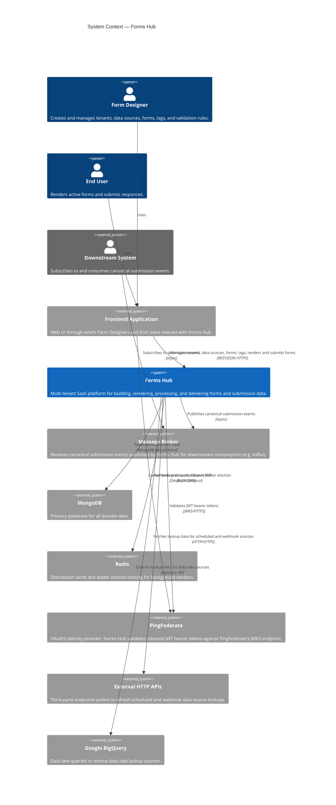
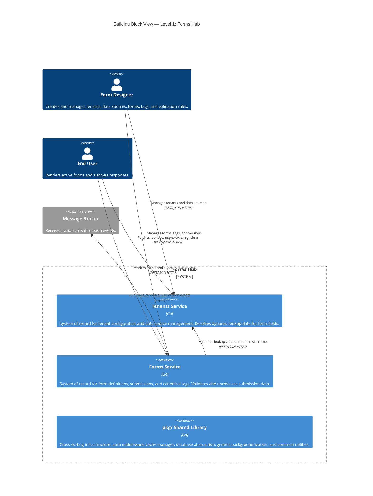
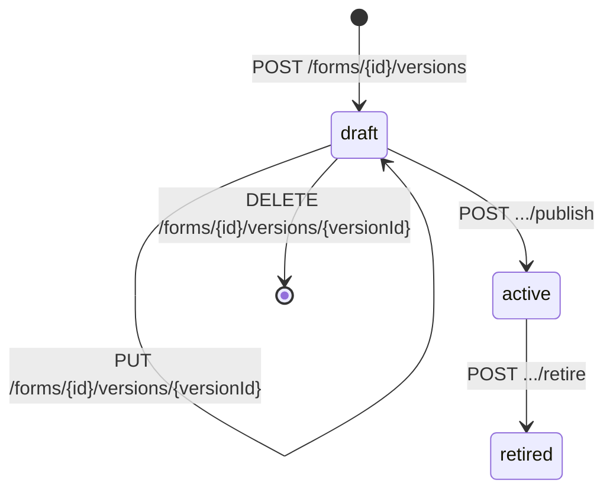
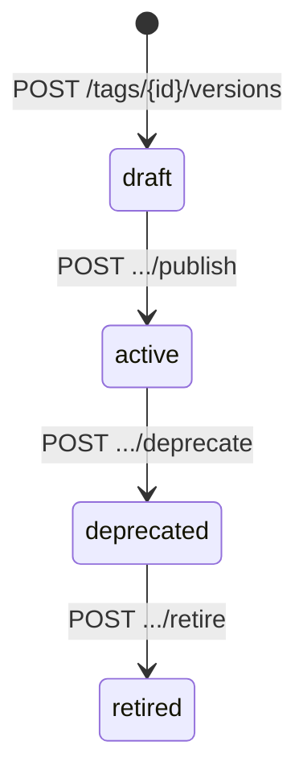

# Forms Hub Architecture

##### A high-level overview of the architecture of Forms Hub, a platform for building and rendering forms.

## 1. Introduction and Goals

This document describes Forms Hub, a multi-tenant Software as a Service (SaaS) system designed to standardize how forms are built, rendered, validated, and consumed across enterprise workflows. The system uses a metadata-driven approach to form definition, enabling forms to be created and modified independently of application code.

### 1.1 Requirements Overview

#### 1.1.1 Business Problem

Enterprise organizations often rely on forms to initiate and drive operational workflows, such as access requests, service requests, and approvals. Over time, multiple form-building solutions have evolved independently to support these needs, leading to a fragmented landscape and one-off implementations to meet specific requirements.

At Wells Fargo, current solutions include:

- **Access Request Tool (ART)**: A legacy suite of applications for managing the request, approval, and fulfillment of requests via automated and manual processes. ART includes a form builder that allows users to create forms for various requests. However, the form builder is tightly coupled to requests, which leads to several issues:
  1. **Embedded Business Logic**: The form builder embeds business logic (service request items or SRIs) directly into the form definition, making it difficult to reuse logic across different forms and leading to duplication of logic.
  2. **Tight Coupling**: Changes to the form definitions impact the downstream processing logic, making it difficult to evolve forms independently of the underlying workflow or integration contracts.

- **WorkX**: A newer platform designed and developed to support Consumer Lending workflows. WorkX includes a form builder that allows users to create forms that are associated with specific tasks in a workflow. In WorkX, a form definition is embedded in the task definition, which reduces the reusability of forms and leading to duplication of form definitions across different tasks.

#### 1.1.2 Product Goals

| Goal                          | Description                                                                                                                                                              |
| ----------------------------- | ------------------------------------------------------------------------------------------------------------------------------------------------------------------------ |
| Centralized Form Management   | Provide a centralized system for form design and management, enabling users to create, modify, and manage forms in a single location.                                    |
| Dynamic Form Rendering        | Provide a low-code form rendering without requiring custom frontend or backend development per form.                                                                     |
| Configurable Validation       | Support configurable validation rules to ensure data quality and consistency; allow users to define validation rules that can be applied to form fields and submissions. |
| Canonical Data Transformation | Normalize submission data into canonical structures independent of form layout or field naming, enabling downstream systems to consume data in a consistent format.      |
| Decoupled Form Design         | Decouple form design from downstream integration contracts, allowing forms to evolve independently of the underlying workflow or integration requirements.               |

#### 1.1.3 Key Use Cases

| Use Case               | Actor(s)               | Description                                                                                                                                                                                          |
| ---------------------- | ---------------------- | ---------------------------------------------------------------------------------------------------------------------------------------------------------------------------------------------------- |
| Design a Form          | Form Designer          | A form designer creates a new form version with pages, sections, and fields. She configures validation rules for form elements, and publishes the form before rendering.                             |
| Render a Form          | End User               | An end user loads an active form version; the system evaluates visibility, required, and read-only rules dynamically and renders the form accordingly.                                               |
| Submit a Form          | End User               | An end user submits a form; the system validates the submission, persists it idempotently, and returns a reference identifier for tracking.                                                          |
| Consume Canonical Data | Downstream System      | A downstream system consumes canonical submission data via a message broker or REST API; the system transforms the submission data into a canonical format and delivers it to the downstream system. |
| Manage Lookup Data     | Form Designer / System | A form designer configures a data source to provide dynamic lookup data for form fields across one or more forms.                                                                                    |

#### 1.1.4 Functional Requirements

| Requirement                   | Description                                                                                                                                                                         |
| ----------------------------- | ----------------------------------------------------------------------------------------------------------------------------------------------------------------------------------- |
| Tenant Management             | The system shall support multiple isolated tenants. Each tenant's forms, submissions, tags, and data sources shall be scoped and inaccessible to other tenants.                     |
| Form Definition               | The system shall allow users to define forms as versioned, metadata-driven schemas composed of pages, sections, and typed fields without requiring application code changes.        |
| Form Versioning               | The system shall support a managed lifecycle for form versions: `draft → active → retired`.                                                                                         |
| Dynamic Form Rendering        | The system shall render forms dynamically from their metadata definition without requiring custom frontend or backend development per form.                                         |
| Configurable Validation       | The system shall support configurable visibility, required, and read-only rules on pages, sections, and fields, evaluated at runtime against submitted values.                      |
| Submission Intake             | The system shall accept form submissions asynchronously and idempotently, associating each with a tenant, form version, and a unique reference ID for external tracking.            |
| Canonical Data Transformation | The system shall map submitted field values to canonical tag versions, normalizing data into consistent structures independent of form layout or field naming.                      |
| Data Source Management        | The system shall support configurable lookup data sources (static, scheduled HTTP, webhook, and data lake) to populate dynamic select fields across forms.                          |
| Tag Management                | The system shall support definition and versioning of canonical semantic tags (`draft → active → deprecated → retired`) that field values are mapped to for downstream consumption. |

### 1.2 Quality Goals

### 1.3 Stakeholders

## 2. Contraints

## 3. Context & Scope

### 3.1 System Context

Forms Hub is a multi-tenant SaaS platform that sits at the center of form design, rendering, submission intake, and canonical data delivery. The diagram below shows the system boundary and all external actors and systems that interact with it.

### 3.2 External Interfaces

| External System          | Direction | Protocol                     | Initiator       | Purpose                                                                                                                                                                                                                   | Status              |
| ------------------------ | --------- | ---------------------------- | --------------- | ------------------------------------------------------------------------------------------------------------------------------------------------------------------------------------------------------------------------- | ------------------- |
| **Frontend Application** | Inbound   | REST/JSON over HTTPS         | Frontend        | Form Designers and End Users interact with both services through a generic web UI.                                                                                                                                        | Active              |
| **MongoDB**              | Outbound  | MongoDB wire protocol        | Both services   | Primary datastore. Tenants Service stores tenant and data source records; Forms Service stores forms, form versions, submissions, and tags.                                                                               | Active              |
| **Redis**                | Outbound  | Redis protocol               | Both services   | Tenants Service caches resolved lookup data. Both services use Redis-backed distributed locking (`SetNX` + Lua scripts) for background worker leader election.                                                            | Active              |
| **PingFederate**         | Outbound  | JWKS over HTTPS              | Both services   | Both services validate inbound JWT bearer tokens by fetching signing keys from PingFederate's JWKS URI. Audience, issuer, expiry, and issued-at claims are verified.                                                      | Active              |
| **External HTTP APIs**   | Outbound  | HTTP/HTTPS                   | Tenants Service | The Tenants Service calls arbitrary third-party HTTP endpoints to fetch lookup key-value pairs for `scheduled` and `webhook` data sources. Supports `GET`, `POST`, `PUT`, and `PATCH` with configurable headers and body. | Active              |
| **Google BigQuery**      | Outbound  | BigQuery API                 | Tenants Service | The Tenants Service queries a configured data lake to resolve lookup data for `data-lake` data sources, using configurable catalog, schema, query, and field mappings.                                                    | Planned (stub only) |
| **Message Broker**       | Outbound  | Async messaging (e.g. Kafka) | Forms Service   | After a submission is accepted and canonical tag mapping is applied, the Forms Service publishes a canonical submission event for downstream consumption.                                                                 | Planned             |

## 4. Solution Strategy

### 4.1 Architecture Style

Forms Hub is built as a microservice-based system with two independently deployable services - the **Tenants Service** and the **Forms Service** - each owning its own distinct domain model and data storage. The services share a deliberate, minimal integration surface: the Forms Service depends on the Tenants Service to resolve data sources configured by tenants to provide dynamic lookup data for form fields.

Within each service, a **Ports and Adapters (Hexagonal)** architecture style is applied. The domain and application logic is fully isolated from infrastructure concerns. Ports interfaces in `core/ports/` define the contracts; adapter implementations in `adapters/` fulfill them. This boundary means HTTP, MongoDB, Redis, and inter-service communication concerns can be swapped out or tested independently of domain logic. In-memory adapters for every infrastructure concern support local development and testing without external dependencies. Both services also share a common `pkg/` library providing the generic background worker, auth middleware, validation utilities, and the strategy registry — keeping shared infrastructure consistent without coupling service domain models.

_Figure 4.1 — Ports & Adapters (Hexagonal) Architecture pattern. Each Forms Hub service follows this structure: driving adapters (REST handlers) on the left, domain and application services at the centre, and driven adapters (MongoDB, Redis, Tenants Service client) on the right._

### 4.2 Technology Decisions

| Technology       | Decision                   | Rationale                                                                                                                                                                                |
| ---------------- | -------------------------- | ---------------------------------------------------------------------------------------------------------------------------------------------------------------------------------------- |
| Go               | Implementation language    | Statically typed, high concurrency, fast startup, and a small runtime footprint suited for independently deployable services.                                                            |
| MongoDB          | Database                   | The deeply nested, polymorphic form definition hierarchy — pages, sections, fields, and per-type attributes — maps naturally to documents without requiring a complex relational schema. |
| Redis            | Cache and distributed lock | Serves a dual purpose without an additional coordination service: lookup data cache in the Tenants Service and distributed leader election for background workers in both services.      |
| chi              | HTTP router                | Lightweight and idiomatic Go; composable middleware chain supports cross-cutting concerns (auth, tenant extraction, idempotency, correlation ID) without framework lock-in.              |
| `expr-lang/expr` | Rule evaluation            | Provides safe, sandboxed evaluation of runtime rule expressions (visibility, required, read-only) without the risks of `eval`-style execution.                                           |
| UUID v7          | Entity identifiers         | Time-ordered UUIDs provide natural chronological sort order in MongoDB without a separate sequence or auto-increment mechanism.                                                          |
| PingFederate     | Identity provider          | Enterprise OAuth2/JWKS integration; JWT validation is implemented and ready to activate when authentication is enforced.                                                                 |

### 4.3 Key Design Decisions

- **Asynchronous submission processing** — `POST /submissions` returns 202 immediately; validation and canonical mapping run in a background worker. This decouples intake throughput from validation latency and enables retries without client involvement. Failed jobs are retried with exponential backoff up to a configurable limit; each attempt is recorded as an audit trail on the submission.
- **Strategy pattern for data sources** — Four lookup strategies (static, scheduled, webhook, data lake) share a common interface and are resolved at runtime via a registry. New source types can be added without modifying existing resolution logic.
- **Strategy pattern for field validation** — Each field type (text, number, select, checkbox, date) has its own validator resolved at runtime. Validation logic is isolated per type and independently testable.
- **Generic background worker** — `BackgroundWorker[J Job]` is fully generic and reused by both services for completely different job types (data source refresh and submission processing). Redis-backed leader election ensures only one replica processes jobs at a time across horizontal scale.
- **In-memory adapters for all infrastructure** — Every repository, cache, and elector has an in-memory implementation. No external dependencies are required for local development or unit testing.
- **Explicit inter-service boundary** — The Forms Service holds a `DataSourceRef` on certain fields and calls the Tenants Service at submission time to validate that the submitted value is a member of the current valid lookup set. The Frontend also calls the Tenants Service independently at render time to populate the field options. Outside of this integration point the services share no runtime state, simplifying failure isolation and independent deployment.

## 5. Building Block View

### 5.1 Whitebox System View

Forms Hub is decomposed into two independently deployable services — **Tenants Service** and **Forms Service** — each owning a distinct domain and datastore, plus a shared **`pkg/` library** providing common infrastructure. This functional decomposition reflects that tenant/data-source configuration and form/submission processing are separate, independently evolvable concerns with no shared domain state.

| Building Block            | Responsibility                                                                                                                                                                                                                                   | Source                      |
| ------------------------- | ------------------------------------------------------------------------------------------------------------------------------------------------------------------------------------------------------------------------------------------------ | --------------------------- |
| **Tenants Service**       | System of record for tenant configuration and data source management. Provides CRUD for tenants and data sources, and resolves dynamic lookup key-value pairs via four configurable strategies (`static`, `scheduled`, `webhook`, `data-lake`).  | `backend/services/tenants/` |
| **Forms Service**         | System of record for form definitions, versioned schemas, submissions, and canonical tags. Manages the full form design and submission processing pipeline, including async validation and canonical data normalization.                         | `backend/services/forms/`   |
| **`pkg/` Shared Library** | Cross-cutting infrastructure shared by both services: JWT auth middleware, cache abstraction, MongoDB database abstraction, generic background worker with leader election, HTTP utilities, and the strategy registry. Contains no domain logic. | `backend/pkg/`              |

#### 5.1.1 Blackbox: Tenants Service

The Tenants Service owns all tenant and data source configuration. It exposes a REST API for managing tenants and data sources, resolves lookup key-value pairs on demand via a runtime strategy registry, and runs a background worker that periodically refreshes expired `scheduled` data source caches from their configured HTTP endpoints.

| Interface                                  | Direction | Description                                                                     |
| ------------------------------------------ | --------- | ------------------------------------------------------------------------------- |
| `GET/POST/PUT/DELETE /api/v1/tenants`      | Inbound   | CRUD for tenant records                                                         |
| `GET/POST/PUT/DELETE /api/v1/data-sources` | Inbound   | CRUD for data sources scoped to a tenant                                        |
| `GET /api/v1/data-sources/{id}/look-ups`   | Inbound   | Resolves lookup key-value pairs for a given data source                         |
| MongoDB                                    | Outbound  | Persists tenant and data source records                                         |
| Redis                                      | Outbound  | Caches resolved lookup data; leader election for the data source refresh worker |
| External HTTP APIs                         | Outbound  | Fetches lookup data for `scheduled` and `webhook` data sources                  |
| Google BigQuery                            | Outbound  | Queries lookup data for `data-lake` data sources (planned)                      |

#### 5.1.2 Blackbox: Forms Service

The Forms Service owns all form definitions, versioned schemas, submissions, and canonical tags. It exposes a REST API for form design and submission intake, runs an async background worker that validates and normalizes pending submissions, and publishes canonical submission events to the message broker upon acceptance.

| Interface                           | Direction | Description                                                                       |
| ----------------------------------- | --------- | --------------------------------------------------------------------------------- |
| `GET/POST/PUT/DELETE /api/v1/forms` | Inbound   | CRUD for forms and their versioned schemas                                        |
| `GET/POST /api/v1/submissions`      | Inbound   | Submission intake (`202 Accepted`) and status retrieval                           |
| `GET/POST/PUT/DELETE /api/v1/tags`  | Inbound   | CRUD for canonical tags and their versions                                        |
| Tenants Service                     | Outbound  | Validates submitted lookup values against the live data source at processing time |
| MongoDB                             | Outbound  | Persists forms, versions, submissions, and tags                                   |
| Redis                               | Outbound  | Leader election for the submission processing worker                              |
| Message Broker                      | Outbound  | Publishes canonical submission events upon acceptance (planned)                   |

### 5.2

### 5.3

## 6. Runtime View

### 6.1 Form Submission Flow

A client submits a form by sending `POST /api/v1/submissions` with an `Idempotency-Key` header. The Forms Service persists the submission with a status of `pending` and immediately returns `202 Accepted` with a reference ID — no validation occurs synchronously. A background worker (leader-elected via Redis) picks up pending submissions, loads the associated form version, and evaluates visibility, required, and read-only rules against the submitted values. For `select` fields backed by a `DataSourceRef`, the Forms Service calls the Tenants Service to resolve the current valid lookup set and validate that the submitted value is a member of it. Note that the Frontend also calls the Tenants Service independently at render time to populate the dropdown options — the validation call at submission time is a server-side confirmation that the selected value remains valid. On success the submission transitions to `accepted` and a canonical submission event is published to the message broker for downstream consumption; on validation failure it transitions to `rejected`. Failed attempts are retried with exponential backoff up to the configured retry limit.

Canonical normalization decouples the submission data from the form's field naming and layout. Each form field carries one or more `FieldTagMapping` entries that associate it with an active tag version. During submission processing, submitted field values are mapped through these tag mappings to produce a normalized output keyed by canonical tag — not by form field key. This means downstream systems consume a consistent data structure regardless of which form version collected the data or how its fields were named.

When a field maps to multiple tag versions, the winning tag is selected through a three-phase resolution: first, `draft` and `retired` tag versions are excluded; then, among the remaining candidates, the highest priority mapping wins; if priorities are tied, the system selects the highest version within the same lineage, or falls back to the most recently updated tag across different lineages.

#### 6.1.1 Example: Requesting a Form-based Catalog Item

This diagram illustrates a concrete example of the submission flow in the context of a service request workflow. The Request Portal and Service Catalog are example external systems outside the Forms Hub boundary — Forms Hub is involved at two points only: serving the form definition when the actor selects a catalog item (step 4), and receiving the completed submission for validation, normalization, and processing at checkout (step 8). The SRI Service shown in the diagram is an example downstream consumer that receives the canonical submission event published by Forms Hub upon acceptance.

### 6.2 Data Source Lookup Resolution

When a client calls `GET /api/v1/data-sources/{id}/look-ups`, the Tenants Service loads the data source from MongoDB and dispatches to the appropriate strategy via a runtime registry keyed by `DataSourceType`. The `static` strategy returns inline lookup data stored directly on the data source record. The `scheduled` strategy returns cached data previously fetched from an external HTTP endpoint by the background refresh worker — trading freshness for low latency. The `webhook` strategy makes a live HTTP call to the configured endpoint on each request, passing any required binding parameters — higher latency but always current. The `data-lake` strategy queries a configured BigQuery dataset using a parameterized query (currently a stub pending implementation). All four strategies return a uniform `[]Lookup` response of `{ value, label }` pairs.

### 6.3 Form Version Lifecycle

Form versions follow a linear, managed lifecycle: `draft → active → retired`. Only `draft` versions can be edited; once published they are immutable. Multiple versions of the same form may be `active` simultaneously, allowing a gradual transition between versions.

| Transition   | Endpoint                                            | Conditions                                                                                        |
| ------------ | --------------------------------------------------- | ------------------------------------------------------------------------------------------------- |
| Create draft | `POST /forms/{formId}/versions`                     | Always allowed; auto-increments version number                                                    |
| Update draft | `PUT /forms/{formId}/versions/{versionId}`          | Only allowed while status is `draft`; locked once published                                       |
| Publish      | `POST /forms/{formId}/versions/{versionId}/publish` | Transitions `draft → active`; does not affect other active versions                               |
| Retire       | `POST /forms/{formId}/versions/{versionId}/retire`  | Transitions `active → retired`; a form cannot be deleted while it has at least one active version |

### 6.4 Tag Version Lifecycle

Tag versions follow a four-stage lifecycle: `draft → active → deprecated → retired`. Unlike form versions, the path to retirement requires passing through `deprecated` first — a tag cannot be retired directly from `active`. This enforces a grace period during which downstream systems can observe the deprecation before the tag is fully retired.

| Transition   | Endpoint                                            | Conditions                                                         |
| ------------ | --------------------------------------------------- | ------------------------------------------------------------------ |
| Create draft | `POST /tags/{tagId}/versions`                       | Always allowed; auto-increments version number                     |
| Publish      | `POST /tags/{tagId}/versions/{versionId}/publish`   | Transitions `draft → active`; only allowed from `draft`            |
| Deprecate    | `POST /tags/{tagId}/versions/{versionId}/deprecate` | Transitions `active → deprecated`; only allowed from `active`      |
| Retire       | `POST /tags/{tagId}/versions/{versionId}/retire`    | Transitions `deprecated → retired`; only allowed from `deprecated` |

## 7. Deployment View

## 8. Crosscutting Concepts

## 9. Architecture Decisions

## 10. Quality Requirements

## 11. Risks and Technical Debt

## 12. Glossary
